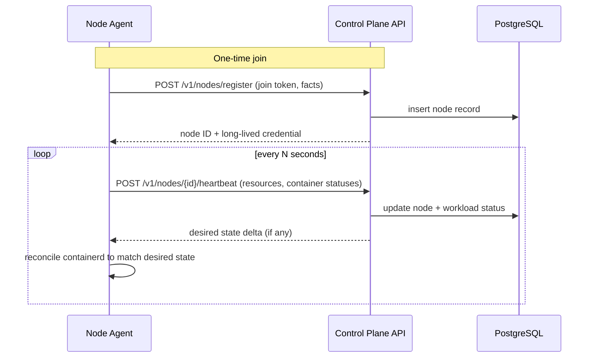
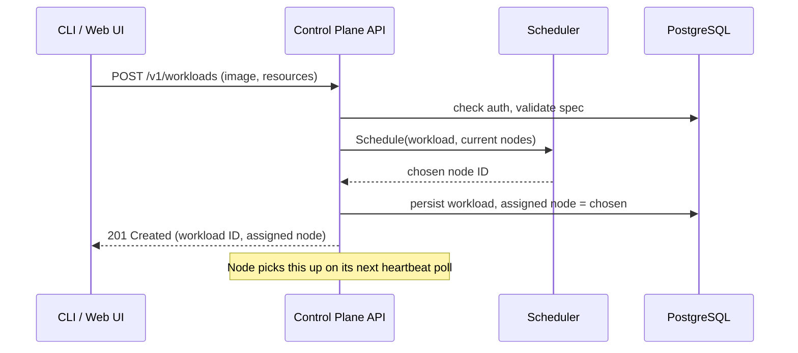

# Ambud Architecture

This document describes the components of Ambud, their responsibilities,
and how they talk to each other. It reflects the target architecture that
the [`ROADMAP.md`](ROADMAP.md) builds toward incrementally — early phases
implement a subset of this, not all of it at once.

## Design principles behind this architecture

1. **Agents pull, they are never pushed to.** Every node agent initiates
   its own connections to the control plane. The control plane never
   opens a connection to a node. This means a node behind a home-router
   NAT with no port forwarding can still join the cluster — it only ever
   needs outbound access to the control plane. It also collapses a whole
   class of firewall/security-group configuration that a push model would
   require.
2. **The control plane decides, agents execute.** Desired state lives in
   one place (PostgreSQL, owned by the control plane). Agents never
   invent state — they reconcile local reality (what containerd is
   running) toward what the control plane told them to run, and report
   back what actually happened.
3. **Control plane and data plane are physically separable, even in
   phase 0.** The control plane never sits in the path of container
   traffic or logs at runtime — only in the path of *decisions*. This is
   what lets a control-plane restart not take down running workloads.
4. **Every component is replaceable behind its interface.** containerd
   could be swapped for another OCI runtime; PostgreSQL could — in
   theory — be swapped for another SQL store. Ambud does not assume the
   scheduler, runtime driver, or store implementations are permanent, so
   each is defined as a narrow Go interface with one concrete
   implementation for now. This is about not painting ourselves into a
   corner, not about building a plugin ecosystem — see
   [ADR 0001](ADR/0001-initial-architecture.md).
5. **The Web UI is a first-class client with zero special access, not an
   afterthought bolted on later.** Everything the Web UI can do, it does
   by calling the exact same REST API the CLI and any external script
   would use — there are no UI-only endpoints, no backend logic that
   assumes "this request came from the dashboard," and no shortcuts that
   bypass validation, auth, or the scheduler. Concretely: the backend
   team (this project, in practice, is one person) could delete the
   entire `web/` directory and the API would be 100% unaffected, and the
   UI team could be swapped out entirely without the API changing. This
   is why the Web UI is scaffolded from [Phase 0](ROADMAP.md#phase-0--project-setup)
   and required, with growing functionality, through the
   [MVP](MVP.md) — it is not a "nice to have" layered on top once the
   "real" backend work is done.

## Components

### CLI (`ambudctl`)

A thin HTTP client over the control plane's REST API. No business logic
lives here — it formats requests, prints responses, and handles local
concerns like config file (`~/.ambud/config.yaml`) and auth token
storage. Everything the CLI can do, the Web UI can do, because both are
just clients of the same API.

Responsibilities: `ambudctl node list`, `ambudctl deploy <spec>`,
`ambudctl ps`, `ambudctl logs <workload>`, `ambudctl start/stop/restart`.

### Web UI

A React + TypeScript single-page app, served as static files (by the API
server itself in early phases — no separate web server needed). It is
the **primary way an operator is expected to use Ambud day to day** —
node list and status, live resource usage, deploying a workload,
starting/stopping/restarting it, viewing logs — every capability in the
[MVP](MVP.md) must be reachable by clicking, not just by typing a
command. The CLI remains equally real (scripting, CI, automation,
low-level debugging) — this isn't "UI with a CLI escape hatch," it's two
peer clients of one API, and both are held to the same functional bar.

The Web UI is explicitly **not** where any authority lives — it renders
what the API returns and calls the same endpoints anyone else could
call. It ships as a real, working (if visually plain) dashboard starting
in [Phase 3](ROADMAP.md#phase-3--control-plane), growing in lockstep
with the API through the MVP; dedicated UI/UX design polish (a real
design system, onboarding flow, visual identity) is intentionally a
later, separate pass — see [`ROADMAP.md`](ROADMAP.md)'s note on this —
so that functional parity isn't blocked on a design system existing
first.

### API Server

The single HTTP entrypoint into the control plane. Owns:

- Request validation and auth (API tokens / session, see Phase 9)
- Translating REST calls into reads/writes against the store
- Exposing the endpoints agents use to register, heartbeat, and pull
  assigned work

In phases 0–8 the API server is not a separate process — it's a package
inside the single `ambud-controlplane` binary, alongside the scheduler
and reconciler. See [`PROJECT_STRUCTURE.md`](PROJECT_STRUCTURE.md) and
the "why one binary" discussion in the ADR. It's built as an internal
package with a clean boundary so it *can* be split into its own process
later without a rewrite, if load or deployment needs ever demand it.

### Control Plane (the process, as a whole)

"Control plane" refers to the `ambud-controlplane` binary and the
PostgreSQL database it owns — the system of record for cluster state. It
is composed of three cooperating pieces that currently share one process
and one Go module but are logically distinct:

- **API server** (above) — the only way in or out
- **Scheduler** (below) — decides node placement for new workloads
- **Reconciler / node registry** — tracks node liveness (heartbeat
  timeouts), marks nodes unreachable, and keeps the "desired state per
  node" view that agents pull from

The control plane holds no container images, runs no containers, and is
never in the path of a request that hits a running workload. If it goes
down, already-running containers keep running — only new deployments and
status updates pause until it's back.

### Scheduler

Given a new workload and the current set of known nodes + their
available resources (from the latest heartbeat), the scheduler picks
which node should run it. It is defined behind a narrow interface:

```go
type Scheduler interface {
    // Schedule returns the node ID the workload should run on,
    // or an error if no node currently satisfies its requirements.
    Schedule(ctx context.Context, w Workload, nodes []Node) (nodeID string, err error)
}
```

The Phase 5 implementation is deliberately simple: filter nodes with
enough free CPU/RAM/disk, then pick the one with the most free RAM
("most-available-fit"). No bin-packing optimization, no priorities, no
affinity/anti-affinity rules, no taints/tolerations. The interface
exists so a smarter strategy can be dropped in later without touching
the API or agent — not because Ambud plans a strategy marketplace.

### Node Agent (`ambud-agent`)

A long-running process on every machine in the fleet. Responsibilities:

- **Register** itself with the control plane on first start, using a
  join token (see [ADR](ADR/0001-initial-architecture.md)).
- **Report facts**: hostname, OS, CPU cores, total/free RAM, total/free
  disk, on every heartbeat.
- **Pull desired state**: "what should be running on me, according to
  the control plane."
- **Reconcile**: compare desired state to what containerd is actually
  running locally, and converge — create, start, stop, or remove
  containers as needed. This is a local control loop, independent of
  network availability: if the control plane is unreachable, the agent
  keeps whatever is already running exactly as it is (fail static, not
  fail empty).
- **Report status back**: per-container state (running, exited, crash
  looping), exit codes, and — on demand — logs.

The agent talks to containerd over containerd's local Unix socket. It
never talks to another node's agent directly (no agent-to-agent
protocol) — all coordination flows through the control plane.

### Container Runtime — containerd

Ambud does not implement a container runtime. It drives
[containerd](https://containerd.io) via its native Go client library
(`github.com/containerd/containerd`), not the CRI (Container Runtime
Interface) shim — CRI exists to satisfy Kubernetes' plugin contract and
brings pod/sandbox concepts Ambud doesn't need. Talking to containerd
directly is simpler and is exactly what the Docker daemon itself does
underneath.

This is the layer that actually pulls images, creates namespaces/cgroups
via `runc`, and runs processes. Ambud's runtime package
(`internal/runtime`) wraps the containerd client behind a small interface
so the agent's reconcile loop doesn't call containerd APIs directly —
useful for testing the reconciler without a real containerd socket, and
in principle for swapping runtimes later.

### Database — PostgreSQL

The single system of record, owned exclusively by the control plane (no
other component talks to it directly — not agents, not the Web UI).
Stores:

- Node registry (identity, join tokens, last-seen, last-reported
  resources)
- Workload specs (desired state: image, resources requested, restart
  policy, assigned node)
- Observed workload status (as last reported by the owning agent)
- Users, API tokens (Phase 9+)

One Postgres instance is a single point of failure for the *control
plane*, not for running workloads — an outage stops deployments and
status updates, not already-running containers (see Reconciler above).
Postgres HA (replicas, failover) is out of scope until there's an actual
need; see the ADR for why Ambud does not build or require a distributed
database.

### Networking Layer

Two very different concerns, handled in two different phases:

1. **Control-plane ⇄ agent traffic** (Phase 2 onward): plain HTTPS REST
   over the operator's existing network (LAN, Tailscale, VPN — Ambud
   doesn't set this up). This is a solved problem; Ambud just needs TLS
   and a token.
2. **Container ⇄ container / user ⇄ container traffic** (Phase 6): this
   is the genuinely hard distributed-systems problem — see
   [`ROADMAP.md`](ROADMAP.md) Phase 6 for why Ambud deliberately starts
   with host-port mapping only (`nodeIP:hostPort`, exactly like
   `docker run -p`) and explicitly defers any cross-node overlay network
   (flannel/wireguard-style mesh) to a future phase, if ever. Ambud will
   not attempt to build a CNI-compatible networking stack.

### Storage Layer

Phase 7 introduces **node-local persistent volumes only**: a directory
bind-mounted into a container, tied to the specific node it was created
on. A workload that requests a volume gets pinned to whichever node
already holds that volume (the scheduler treats it as a hard placement
constraint). There is no replication, no distributed filesystem, and no
plan to build one — see the ADR's "why not a distributed database"
reasoning, which applies equally to distributed storage. If Ambud ever
needs cross-node volume replication, the intent is to integrate an
existing mature project rather than build one.

## Control plane vs. data plane

This distinction matters enough to state explicitly, since it drives
several decisions above:

- **Control plane** = the `ambud-controlplane` process + PostgreSQL +
  the CLI/Web UI's calls into it. This is where *decisions* are made and
  *desired state* is stored. Low request volume, can tolerate brief
  downtime.
- **Data plane** = node agents + containerd + the running containers +
  the network paths between them and their users. This is where
  *work actually happens*. Must keep running even if the control plane
  is temporarily unreachable.

A node agent that loses its connection to the control plane does not
stop or tear down its containers — it keeps reconciling toward the last
desired state it knows about and just stops picking up new work until
connectivity returns.

## Communication flows





Note the API server never talks to a node directly to make something
happen "now" — even a user-triggered deploy is realized asynchronously,
the next time that node's agent polls. Early phases accept this latency
(a few seconds, bounded by heartbeat interval) as the simplest correct
design. A future low-latency push channel (e.g., a long-lived gRPC
stream the agent keeps open) is a possible Phase 8+ optimization, not a
Phase 3 requirement — see [`ROADMAP.md`](ROADMAP.md) Phase 8.

## What this architecture explicitly does not include

- No Kubernetes API compatibility, no CRDs, no YAML-as-a-platform
- No custom container runtime
- No custom overlay network / CNI plugin
- No distributed consensus (Raft/etcd) — one Postgres instance is the
  source of truth
- No multi-tenancy / namespaces in early phases
- No autoscaling, no multi-region, no live migration

See [`ADR/0001-initial-architecture.md`](ADR/0001-initial-architecture.md)
for the reasoning behind each of these exclusions, and
[`ROADMAP.md`](ROADMAP.md) for what, if anything, might revisit them
later.
