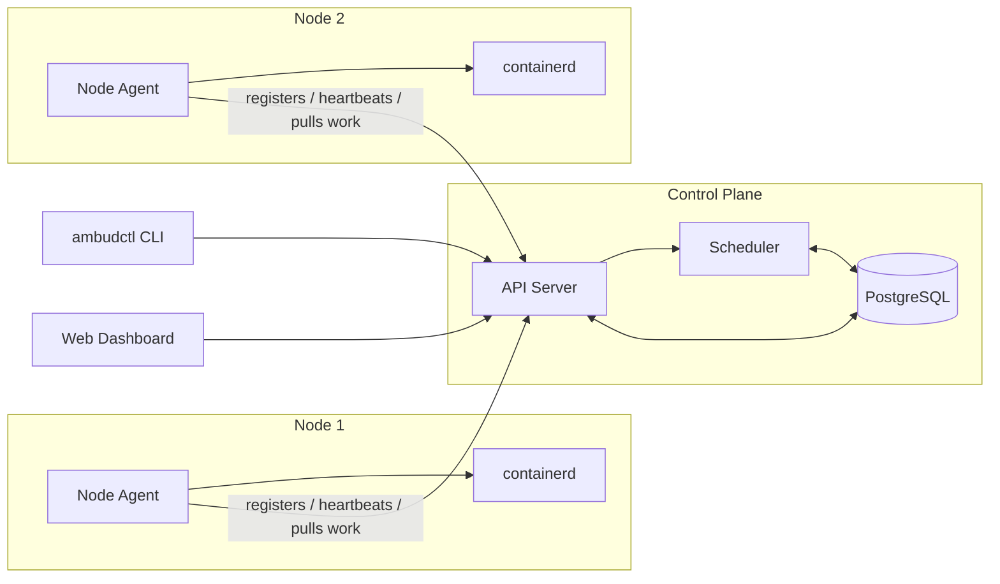

# Ambud

**Turn the old computers in your closet into a private cloud.**

Ambud is a lightweight, self-hosted infrastructure platform. Point it at a
handful of machines — an old gaming PC, a spare laptop, a couple of
Raspberry Pis — and get back the boring, useful parts of AWS: a control
plane that knows what's running where, a way to deploy containers to any
machine in the fleet, and a dashboard to see it all. No Kubernetes cluster
to babysit, no cloud bill.

> **Status: Phase 0 — repo scaffolding.** No agent, no control plane, no
> real UI yet. See [`ROADMAP.md`](ROADMAP.md) for what's being built and in
> what order, and [`MVP.md`](MVP.md) for the first real milestone.

## Why does this exist?

Most homelab / self-hosting tooling falls into two camps: single-machine
tools (plain Docker, Portainer) that don't know about your other machines,
or full Kubernetes, which is powerful but heavy — built for fleets of
thousands, not three old PCs under a desk. There isn't much in between.

Ambud is that middle ground: a real control-plane/agent architecture,
built on mature, boring technology (containerd, PostgreSQL, plain REST),
that scales down to "I have two machines" without dragging in etcd,
kubelet, CNI plugins, and a YAML dialect.

It's also a deliberately-chosen vehicle for learning Go by building
something real instead of following a tutorial — see
[`GO_LEARNING_PATH.md`](GO_LEARNING_PATH.md).

## Core vision

- **Controlled entirely through a web dashboard.** Register a node,
  deploy a container, start/stop/restart it, watch its resource usage —
  all by clicking, not by memorizing CLI flags. The CLI (`ambudctl`)
  exists as a first-class peer for scripting and automation, but every
  capability is required to work identically from the UI — see
  [`ARCHITECTURE.md`](ARCHITECTURE.md)'s design principles.
- **Multiple machines, one control plane.** Add a node, it shows up.
  Remove one, workloads elsewhere are unaffected.
- **Containers as the workload unit.** No custom runtime — Ambud drives
  [containerd](https://containerd.io), the same engine Docker and
  Kubernetes use underneath.
- **Boring, provable infrastructure.** PostgreSQL for state, REST (and
  later gRPC) for APIs, systemd for process supervision. Nothing here
  should surprise an experienced backend engineer.
- **Grow into complexity, don't start with it.** No Kubernetes-level
  scheduling, no custom overlay networks, no distributed storage engine —
  until (if ever) the project actually needs them. See the
  [ADR](ADR/0001-initial-architecture.md) for why.

## Architecture, at a glance



The control plane holds desired state and decides *what should run
where*. Node agents, running on every machine you add to the fleet, pull
that desired state and make it real by driving containerd locally. Full
breakdown, including the control-plane/data-plane split, in
[`ARCHITECTURE.md`](ARCHITECTURE.md).

## Roadmap

Development is broken into 11 phases, from "hello world CLI" to
"production-hardened multi-node cluster." Each phase ships something
runnable. Full detail in [`ROADMAP.md`](ROADMAP.md); the short version:

| Phase | Milestone |
|---|---|
| 0 | Repo, tooling, CI scaffolding |
| 1 | Single-node prototype (CLI drives containerd directly) |
| 2 | Node agent (long-running service, local API) |
| 3 | Control plane + PostgreSQL (still one node) |
| 4 | Second machine joins the cluster |
| 5 | Container scheduling across nodes |
| 6 | Networking (port exposure, service discovery) |
| 7 | Storage (local persistent volumes) |
| 8 | Monitoring (resource metrics, Prometheus exposition) |
| 9 | Authentication & authorization |
| 10 | Production hardening (TLS, upgrades, backups) |

The **MVP** — the smallest version worth using — lands at the end of
Phase 5. See [`MVP.md`](MVP.md).

## Quick start

```sh
git clone https://github.com/vikas0686/ambud.git
cd ambud
make build
./bin/ambudctl --version
```

That's the whole quick start for now — `ambudctl` has no real commands
yet. This section grows into an actual "deploy your first container"
walkthrough once Phase 1 lands. See [`DEVELOPMENT.md`](DEVELOPMENT.md)
for full local environment setup.

## Documentation

- [`ROADMAP.md`](ROADMAP.md) — phased build plan
- [`MVP.md`](MVP.md) — the smallest useful version of Ambud
- [`ARCHITECTURE.md`](ARCHITECTURE.md) — component design and data flow
- [`PROJECT_STRUCTURE.md`](PROJECT_STRUCTURE.md) — repo layout and reasoning
- [`GO_LEARNING_PATH.md`](GO_LEARNING_PATH.md) — learning Go through Ambud
- [`DEVELOPMENT.md`](DEVELOPMENT.md) — local environment setup
- [`ADR/0001-initial-architecture.md`](ADR/0001-initial-architecture.md) — key decisions and alternatives considered

## Contributing

_Not open for external contribution yet — the project is still
establishing its own foundations (see Phase 0–1 in the roadmap). A
`CONTRIBUTING.md` with setup instructions, coding conventions, and PR
expectations will be added once there's working code to contribute to._

## License

Licensed under the [Apache License, Version 2.0](../LICENSE).
